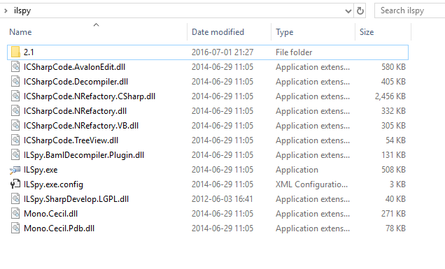
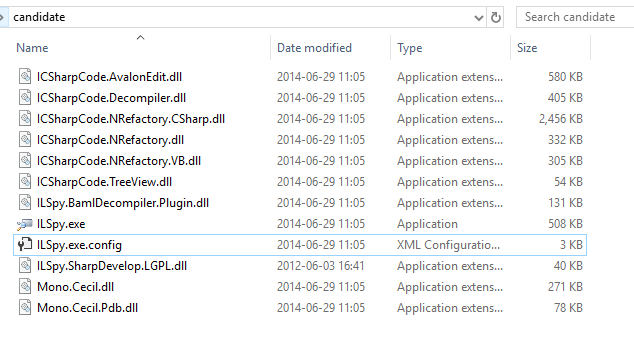
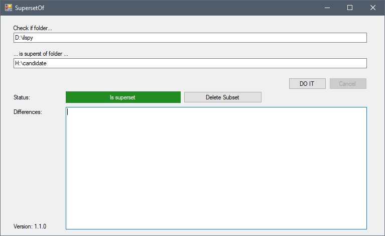
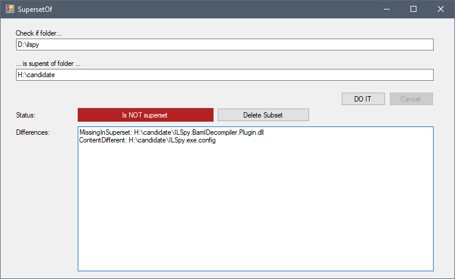

# SupersetOf
Utility that checks if a folder is a superset of another folder (to detect duplicates and help cleaning up disk space and stuff).

## Example
This folder contains ILSpy:

This folder also seems to contain the same thing, but you want to delete it (if it's really the same thing):

If the superset folder does indeed contain all files that are in the subset (candidate) folder, then it is safe to delete the subset.

If the superset folder is missing files, or individual files are different, then it is not a true superset. You'd have to check out what's wrong.

